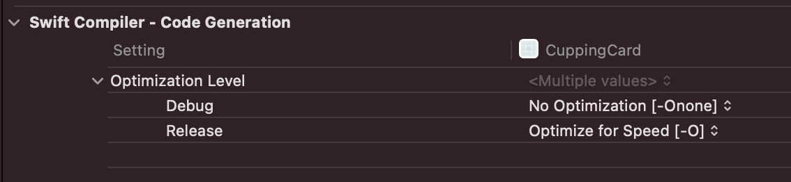
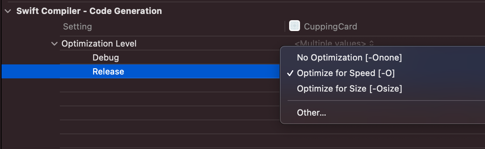
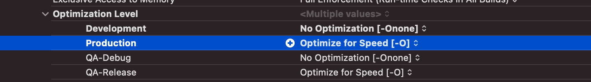

### 릴리즈 앱에서 assertFailure가 발생했다!! 😱
Crashlytics에서 assertFailure가 발생해서 앱이 크래쉬나고 있다는 리포트를 받았습니다.

이미 앱스토어에 올라가 있는 앱에서 assert문이 실행되었다는 게 매우 이상했는데요. 
(동시에 매우 공포스러움 + 블로그에 글 쓸거리 늘었다는 생각ㅎㅋ)

이 이슈를 수정하면서 assert와 Optimization Level에 대해서 공부한 내용을 정리해보았습니다.

### assert가 뭔가요?
assert는 디버깅을 할 때 오류가 생기면 안되는 곳에 작성하여 디버깅을 쉽게 하기 위한 함수입니다.

(Optimization 설정을 건드리지 않았다는 전제 하에)디버그 모드에서는 `assert`에 조건을 만족하지 못하는 값이 들어오면 메세지를 출력한 후 프로그램이 중단되고 디버그 가능한 상태로 전환됩니다.

다음은 아주 간단하게 assert를 사용하는 예시입니다.
```swift
let name: String? = "sally"
assert(name != nil, "이름은 nil일 수 없습니다!")
```

실제 배포되는 앱에서도 assert와 같은 기능을 사용하고 싶다면 `precondition`을 사용하면 됩니다.

### Optimization Level 기본 설정 값
프로젝트를 생성한 직후 Target > Build Settings > Swift Compiler > Optimziation Level이 아래와 같이 설정되어있는 것을 확인할 수 있습니다.



### Optimization Level 종류

##### -Onone
최소한의 최적화를 수행하고 모든 디버그 정보를 보존합니다.

assert condition 실행결과가 false이면 message를 출력한 후 프로그램이 중단되고 디버그 가능한 상태로 전환됩니다.

##### -O
Xcode Release 모드의 기본 값으로 assert condition이 실행되지 않아 프로그램에 영향을 미치지 않습니다.

##### -OSize
성능보다 코드의 크기를 우선시하여 최적화하는 모드.

[Swift team에 따르면](https://swift.org/blog/osize/) -OSize를 사용한 경우에 코드 크기가 5% ~ 30% 감소했다고 합니다.
하지만 성능은 전적으로 프로젝트에 달려있고 성능 차이는 5% 미만으로 크지 않지만 성능에 민감한 코드인 경우에는 -O를 사용하는 것을 더 권장합니다.

##### -Ounchecked
최상의 성능을 위해서 안전성 검사를 건너 뛰는 설정입니다.
타입 체크나 오버플로우 체크도 하지 않기 때문에 일반적으로 사용할 수 없는 옵션입니다.

### 이슈 해결 완료😎
원인: Production의 Optimization Level 값이 -Onone으로 설정되어 있었음. 
(아마도 Scheme을 추가할 때 값이 잘못 들어간 것으로 보임.)

해결 방법: Optimization Level > Production 값을 -O로 설정해준다!!




### References
https://github.com/apple/swift/blob/main/docs/OptimizationTips.rst#id13

https://swift.org/blog/osize/


공부하면서 작성한 내용이라 틀린 부분이 있을 수 있습니다! 오류를 발견하신 경우에는 댓글 주시면 정말 감사하겠습니다.🙇‍♀️