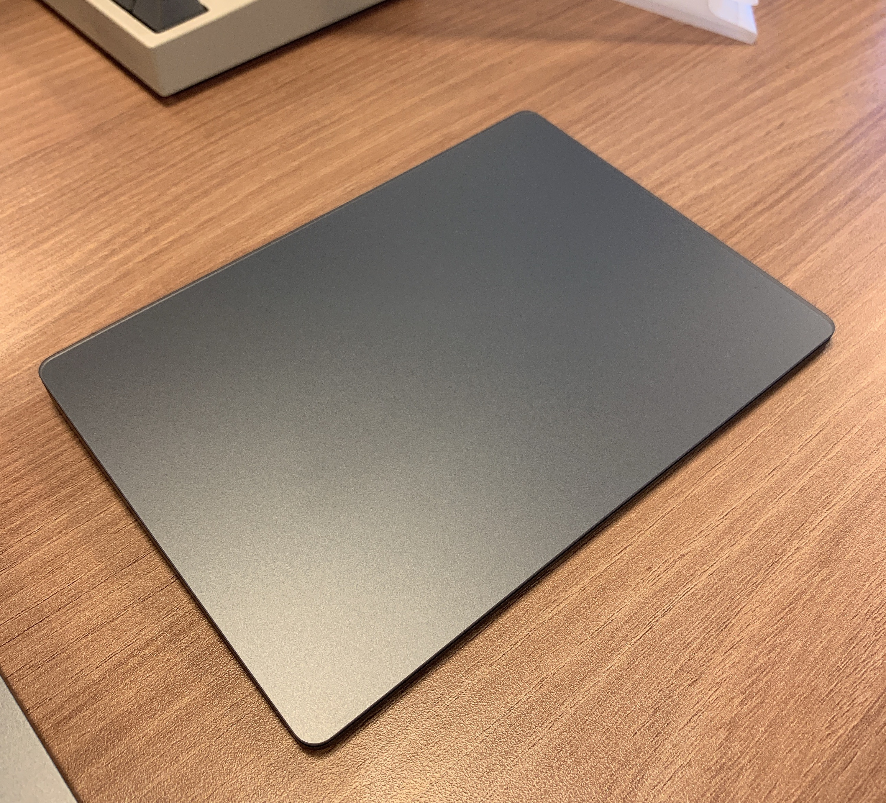
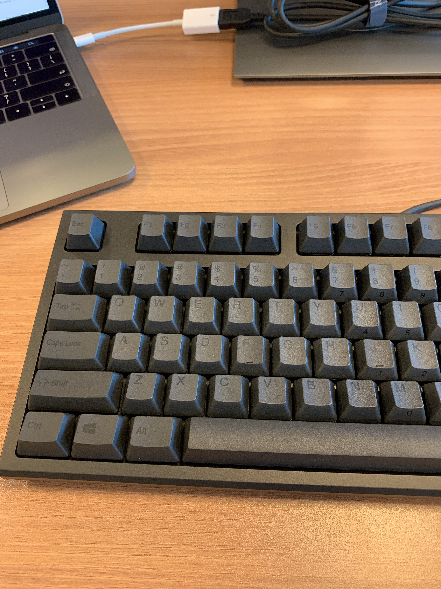
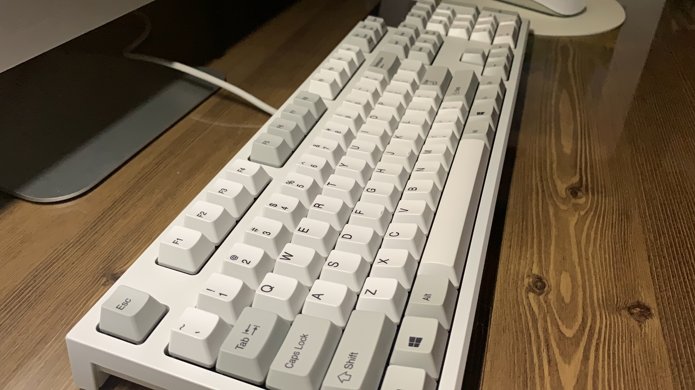
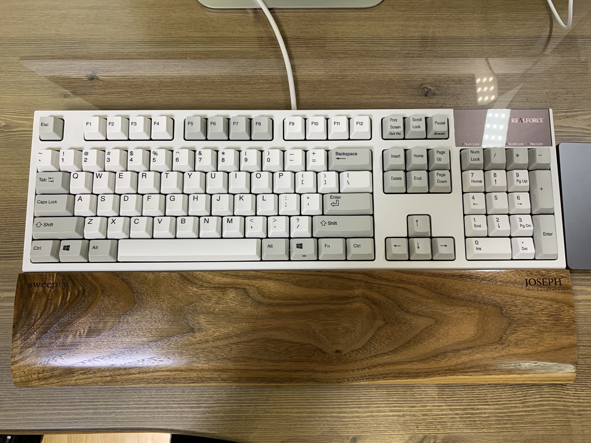
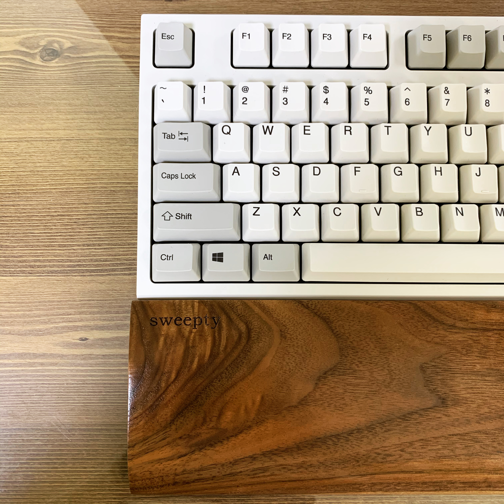
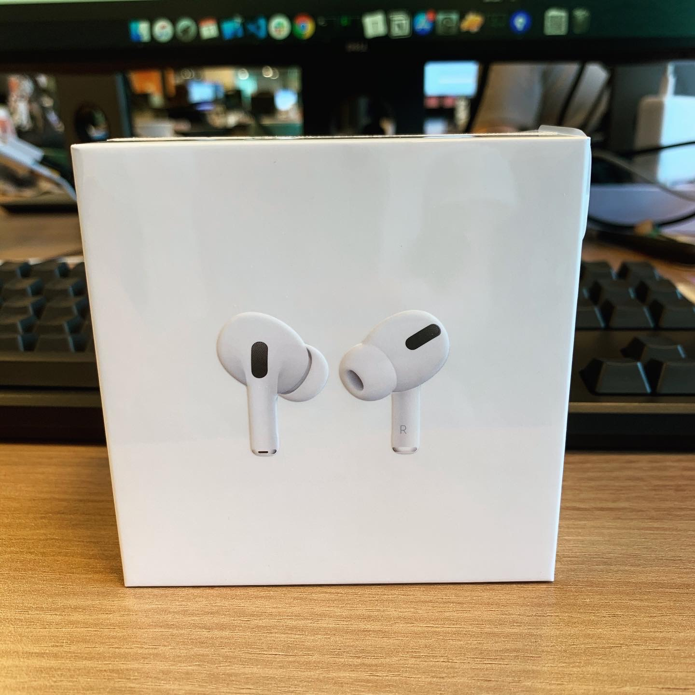
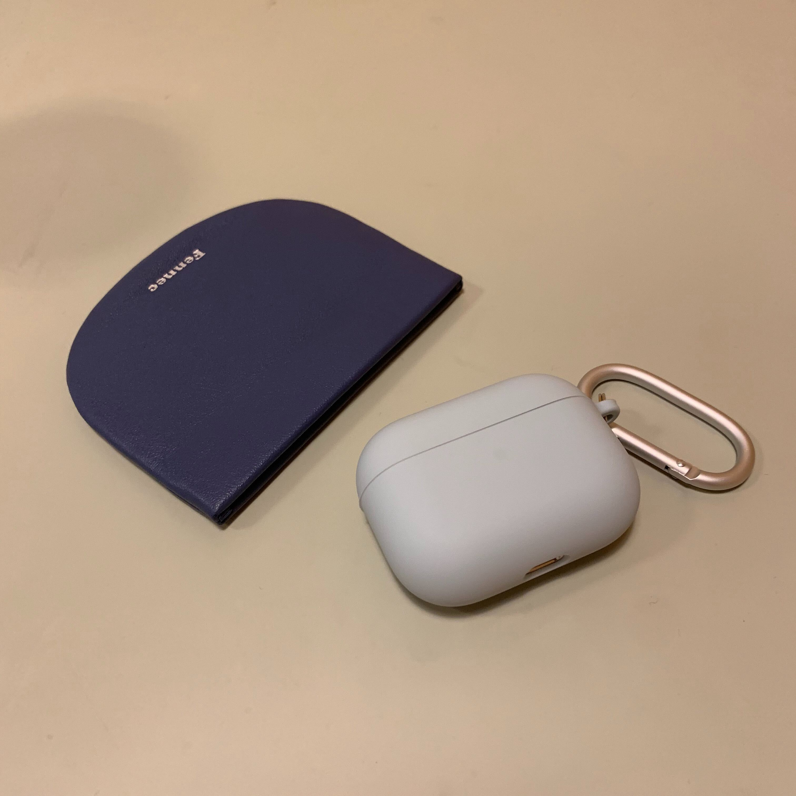

그동안 지른 만족도 200% 장비 소개

나는 내가 이렇게 장비/기계에 대한 욕심이 있는지 몰랐는데... 장비만 보면 눈돌아간다 @.@

그동안 질렀던 삶의 질을 높여준 장비템 5가지를 소개하고자 한다. 

### 1. 트랙패드

첫 월급으로 가장 먼저 산건 트랙패드였다. 원래는 매직 마우스를 쓰고 있었는데 손목이 너무 아파서 트랙패드가 더 나을 것 같아 바로 구매했다.. 실버보다 +2만원을 더 줌으로써 스페이스 그레이의 멋짐을 샀다. 역시 멋있는게 최고다.  2019년에 산 것 중 제일 잘 산 것 2위.

### 2. 리얼포스 R2 저소음 30g 차등 텐키리스

2019년 가장 잘 산 것 1위에 등극한 **리얼포스 R2 무접점 저소음 30g 차등 텐키리스**이다. 정말 최고로 잘 샀다고 생각하는 것이다. 사실 리얼포스는 너무 비싸서 레오폴드 무접점을 사려고 했는데 사수님들께서 어차피 나중에는 끝판왕인 리얼포스로 가게 된다면서 돈 낭비하지말고 처음부터 끝판왕으로 가라는 빛같은 조언을 해주신 덕분에 신세계를 맛 봤다. 최고다! 역시 비싼 만큼 레오폴드랑은 키감이 차원이 다르다. 최근에는 컬러 키캡을 사서 꽂아주었다. 기분 전환 되고 좋다.

### 3. 리얼포스  R2 저소음 30g 균등 풀배열

2019년 12월에 도쿄여행을 갔을 때 아버지가 졸업선물을 고르라고 하셨는데 닌텐도 스위치랑 키보드 중에 고민하다가 결국 리얼포스 키보드를 샀다. 이케부쿠로 빅카메라 PC관에서 구매했다. 위에 리얼포스가 30g 차등이어서 이번에는 45g으로 가볼까 했는데 막상 타건해보니 생각보다 무겁고 뻑뻑한 느낌이 들어서 30g 균등 풀배열로 결정했다. 그런데 케바케이겠지만 풀배열은 가로 너비가 넓어서 트랙패드나 마우스를 쓸 때 불편하다. 다음에 또 키보드를 산다면 무조건 텐키리스로 살 것이다ㅠㅠ ~~그런데 요즘에는 45g도 궁금하다.~~

유튜브에 언박싱 및 타건하는 영상을 업로드 해보았다.

<iframe width="560" height="315" src="https://www.youtube.com/embed/2xzZYo7TpGw" frameborder="0" allow="accelerometer; autoplay; encrypted-media; gyroscope; picture-in-picture" allowfullscreen></iframe>

<iframe width="560" height="315" src="https://www.youtube.com/embed/M-zcD9_4PdQ" frameborder="0" allow="accelerometer; autoplay; encrypted-media; gyroscope; picture-in-picture" allowfullscreen></iframe>

**리얼포스 흰색 vs 검은색**

검은색은 확실히 먼지가 잘 보이지만 검은색만의 멋짐이 있다.
흰색은 레트로 느낌이고 깔끔하다.

**텐키리스 vs 풀배열**

텐키만 더 달렸을 뿐인데 그냥 사도 괜찮겠지라고 생각했는데... 차이가 생각보다 크다.
내 경우에는 마우스나 트랙패드를 쓸때 텐키리스는 30도 정도 손을 틀면 되지만 풀배열은 거의  60도 정도 틀어야한다.
나처럼 마우스나 트랙패드를 많이 쓰는 사람이라면 텐키리스를 추천한다.

### 4. 죠셉공방 원목 팜레스트

이상하게 집에서 키보드를 쓰면 손목이 너무 아팠다. ~~회사에서 일을 더 많이 하는데 대체 왜?~~ 그래서 큰 맘 먹고 죠셉공방의 원목 팜레스트 월넛 색상을 구매했다. 코로나 때문에 재택근무로 전환되어서 생각보다 더 많이 사용하게 되었다ㅎㅎ 키보드랑 팜레스트 안 샀으면 재택근무할 때 어떡할 뻔 했어... 내 경우에는 팜레스트를 쓰고 나서 부터는 손목이 아픈 현상이 확실히 사라졌다. 사장님이 추천해주시는대로 가로 455, 높이 19 세로 90 으로 맞췄는데 딱 좋다. 내 깃헙 아이디로 각인도 했다. 역시 사람들이 좋다고 하는 건  다 이유가 있다.

### 5. 에어팟 프로

에없찐으로 몇년 동안 버티면서 벼르고 벼르다가 결국 사버린 에어팟 프로.. 인이어 타입이어서 귀에 딱 맞고 아프지 않아서 좋고 노이즈 캔슬링 기능이 정말 최고다!!! 누가 지하철에서 에어팟 프로를 끼면 이 세상에 나와 32만원 밖에 없는 것 같다고 표현하던데 과언이 아니다. 굳굳.. 시끄러울 때나 집중할 때마다 끼고 있다. 처음에는 비행기탔을 때처럼 귀가 먹먹해서 걱정했는데 역시 인간은 적응의 동물이라고 적응되면 괜찮아진다. 에어팟 케이스는 엘라고의 리퀴드 하이브리드인데 에어팟 프로 본체에 딱 맞고 유격도 없으며 먼지도 잘 붙지 않는다. 동생한테는 슬림 케이스 야광을 사줬는데 케이스가 얇아서 그런지 확실히 유격이 많이 생겨서 딱 붙지도 않아 정말 별로였다. 다들 리퀴드 하이브리드로 사시길...ㅠㅠ

지금까지 쓴 글을 다시 읽어보니까 '비싼게 최고다', '정말 좋다 ' 이런 말 밖에 없네.. 하지만 달리 표현할 방법이 없는 걸. 아무튼 삶의 질을 향상시켜준 장비들을 소개해봤다.