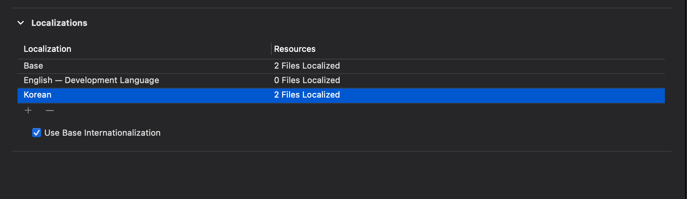
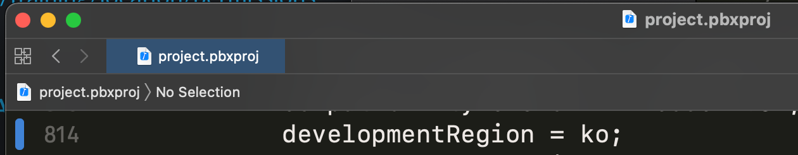
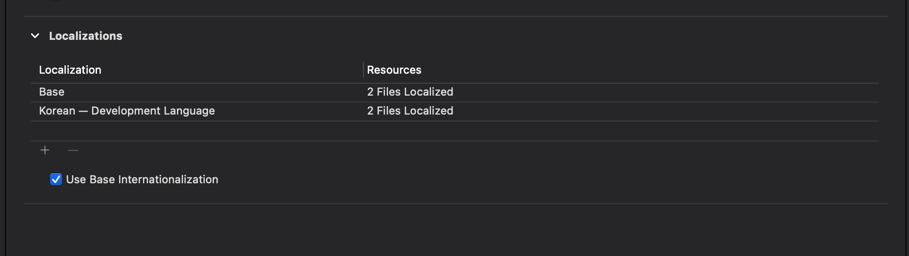
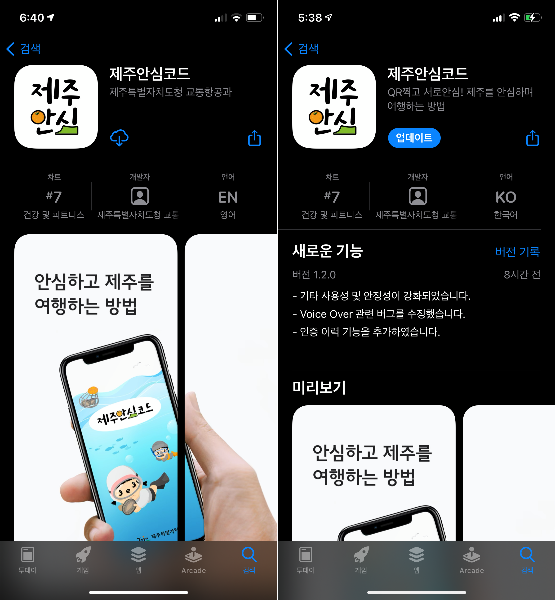

### iOS 앱 지원 언어를 한국어로 변경하기

1. Localizations에 Korean 추가

2. `[프로젝트명].xcodeproj/project.pbxproj`에서 `developmentRegion = en;`을 `ko` 로 변경

3. English localization 파일 삭제(optional)

현재 내가 참여하고 있는 프로젝트는 다국어를 지원하지 않기 때문에 영어 파일은 삭제해주었다.

언어가 한국어로 변경된 것을 확인할 수 있다

