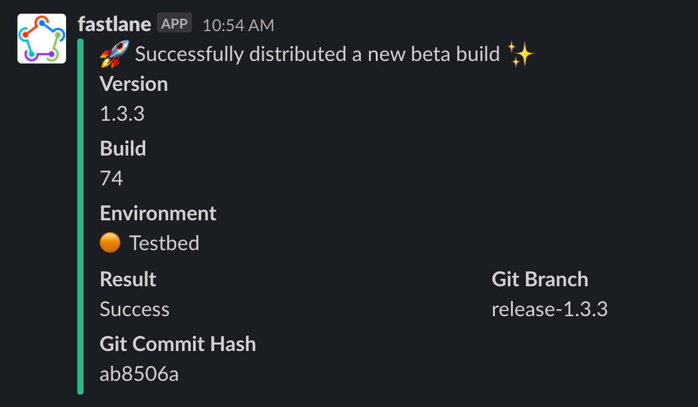

### 🤔 Flutter에서 TestFlight에 배포하려면?

1. `$ flutter build ios` 로 릴리즈 빌드를 생성한다.
2. version과 build number를 올린다.
3. Xcode에서 Archive. (기다림 필요...)
4. AppStore Connect에 Distribute. (기다림 필요...)
5. TestFlight에 빌드가 올라가면 슬랙으로 공유한다.

**기존 배포 방식은 오래 기다려야하고 너무 귀찮다!!** 😫

하루에 몇번씩 배포를 하다보니 빌드와 배포 자동화 필요성이 절실해져서 Fastlane을 도입하기로 결심했다.

[Fastlane](https://docs.fastlane.tools/)은 iOS App과 Android App 빌드와 배포를 자동화 시켜주는 오픈소스 툴이다.

기본적인 Fastlane 사용방법은 [Flutter 공식 fastlane 문서](https://flutter.dev/docs/deployment/cd)에 정리되어 있다.

나의 목표는 다음 2가지였다.

1. 개발 운영 환경 변수 잘 관리하기(Production, Staging and etc...)
2. 릴리즈 빌드를 뜨는 것(flutter build ios)까지 자동화에 포함하기


### 🌏 환경 변수 설정하기

fastlane은 env파일로 환경 변수를 관리할 수 있다.

`fastlane` 디렉토리에 있는 `.env` 파일에는 공통으로 사용하는 부분을 명시해주면 된다.

.env

```
SLACK_URL="your-slack-webhook-url"
APPLE_ID="your-apple-id"
```

우리 회사의 경우에는 각자의 애플 계정을 사용하고 있기 때문에 Apple Id도  env 파일에서 따로 관리하도록 했다.

운영 환경 파일은 Production용 `.env.live` 와 Staging용 `.env.testbed`를 생성했다.

1. slack 메세지를 보낼 때 사용할 이모지
2. 환경 변수 이름
3. 릴리즈 빌드 시에 사용할 main 경로

.env.live

```
ENV_EMOJI="🔵"
ENV="Live"
MAIN_TARGET="lib/main_live.dart"
```

.env.testbed

```
ENV_EMOJI="🟠"
ENV="Testbed"
MAIN_TARGET="lib/main_testbed.dart"
```

> 환경 변수를 불러오려면 `ENV["변수명"]` 으로 불러오면 된다.
>
> ex)  `ENV["ENV_EMOJI"]` ,  `ENV["MAIN_TARGET"]` 


아래는 환경변수에 맞게 TestFlight 배포를 하는 `beta` lane이다.

```
desc "Push a new beta build to TestFlight"
  lane :beta do
    # Fetching the latest build number from TestFlight
    increment_build_number(
      build_number: latest_testflight_build_number + 1,
	xcodeproj: "Runner.xcodeproj"
    )

    # 배포 시작 시 슬랙 메세지 보내기
    send_slack_message(msg: "💫 TestFlight 배포를 시작합니다.")

    # Flutter build iOS - 설정한 환경변수에 맞는 main으로 빌드
    # (이 lane에 대한 설명은 아래에 있습니다.)
    flutter_build_ios

    # Build app
    build_app(workspace: "Runner.xcworkspace", scheme: "Runner")

    # Upload to testflight
    upload_to_testflight

    # Send slack message
    send_slack_message(msg: "🚀 Successfully distributed a new beta build ✨")
  end  

  # Send slack message
  lane :send_slack_message do |options|
    version = get_version_number(xcodeproj: "Runner.xcodeproj")
    build_number = get_build_number(xcodeproj: "Runner.xcodeproj")
    slack(
      message: options[:msg],
      payload: {
        "Version" => :version,
        "Build" => build_number,
        "Environment" => ENV[ENV_EMOJI]+ " "+ ENV['ENV']
      },
    )
  end
```

fastlane 커맨드 실행 시에 `--env` 옵션을 사용하면 환경 변수를 선택할 수 있다.

```bash
$ fastlane [lane 이름] --env [환경변수 파일 이름]
$ fastlane beta --env live
$ fastlane beta --env testbed
```

### 🚀 자동화에 릴리즈 빌드 생성 작업 포함하기

와 자동화 환경 다 만들었다!!😆

라고 생각했지만.. 
우리는 Flutter를 사용하고 있기 때문에 릴리즈 빌드 생성 단계까지 포함해서 아래와 같은 커맨드 라인을 실행해야했다.

1. `$ flutter build ios -t lib/main_live.dart`  로 릴리즈 빌드 생성
2. `$ cd ios`
3. `$ fastlane beta --live`

이러면 자동화를 한 의미가 무색해지기 때문에 이 부분도 fastlane 실행 시에 포함하기로 했다.

FastFile에서 [sh](https://docs.fastlane.tools/actions/sh/)를 사용하면 shell command를 실행할 수 있다.

아래는 flutter build ios를 실행하는 lane이다. 

```
default_platform(:ios)

platform :ios do
  # Flutter build iOS
  lane :flutter_build_ios do
    # ios 디렉토리에서 cd ..로 프로젝트 root 경로로 이동한다.
    sh("cd", "..")
    
    # flutter clean 실행
    sh("flutter", "clean")
    
    # flutter build ios로 릴리즈 빌드를 생성한다.
    # -t는 main 경로를 지정해주는 옵션이다.
    # 여기서 ENV['MAIN_TARGET']은 "lib/main_live.dart"이다.
    sh("flutter", "build", "ios", "--no-codesign", "-t", ENV['MAIN_TARGET'])
  end
end
```


### 결과

FastFile 전체 코드

```
# This file contains the fastlane.tools configuration
# You can find the documentation at https://docs.fastlane.tools
#
# For a list of all available actions, check out
#
#     https://docs.fastlane.tools/actions
#
# For a list of all available plugins, check out
#
#     https://docs.fastlane.tools/plugins/available-plugins
#

# Uncomment the line if you want fastlane to automatically update itself
# update_fastlane

default_platform(:ios)

platform :ios do

  desc "Push a new beta build to TestFlight"
  lane :beta do
  
    # Fetching the latest build number from TestFlight
    increment_build_number(
      build_number: latest_testflight_build_number + 1,
	xcodeproj: "Runner.xcodeproj"
    )

    send_slack_message(msg: "💫 TestFlight 배포를 시작합니다.")

    # Flutter build iOS
    flutter_build_ios

    # Add badge to app icon (only testbed)
    add_badge_to_icon

    # Build app
    build_app(workspace: "Runner.xcworkspace", scheme: "Runner")

    # Upload to testflight
    upload_to_testflight

    # Send slack message
    send_slack_message(msg: "🚀 Successfully distributed a new beta build ✨")
  end  

  # Send slack message
  lane :send_slack_message do |options|
    version = get_version_number(xcodeproj: "Runner.xcodeproj")
    build_number = get_build_number(xcodeproj: "Runner.xcodeproj")
    slack(
      message: options[:msg],
      payload: {
        "Version" => :version,
        "Build" => build_number,
        "Environment" => ENV[ENV_EMOJI]+ " "+ ENV['ENV']
      },
    )
  end

  # Flutter build iOS
  lane :flutter_build_ios do
    sh("cd", "..")

    puts "Flutter clean"
    sh("flutter", "clean")

    puts "Flutter build iOS"
    sh("flutter", "build", "ios", "--no-codesign", "-t", ENV['MAIN_TARGET'])
  end
  
  # Add badge to app icon
  private_lane :add_badge_to_icon do
    if ENV["ENV"] == "Testbed"
      add_badge(alpha: true, dark: true)
    end
  end
  
  # Error handling
  error do |lane, exception|
    slack(
      message: "😱 "+exception.message,
      success: false
    )
  end
end

```

이제 command line 한 줄만 실행하면 배포에 필요한 모든 과정을 실행할 수 있게 되었다!

```bash
$ fastlane beta --env live
$ fastlane beta --env testbed
```


testbed인 경우에는 [badge](https://docs.fastlane.tools/actions/badge/)로 
앱 아이콘에 alpha 뱃지를 달아주도록했다.

### 🥳 Fastlane으로 배포 성공!


TestFlight에 배포가 되면 이렇게 슬랙 메세지가 날아온다! 

그동안 개발 운영 환경에 따른 다중 빌드와 flutter build에 고통받았었는데 광명을 찾을 수 있었다. 
Fastlane은 알면 알수록 재밌고 신기하고 좋은 기능도 많다. 
좀 더 공부한다면 업무 효율성을 효과적으로 높일 수 있을 것으로 기대한다. 
다들 츄라이 츄라이해보시길!

혹시 틀린 점이 있다면 댓글로 알려주시면 정말 감사하겠습니다.😄