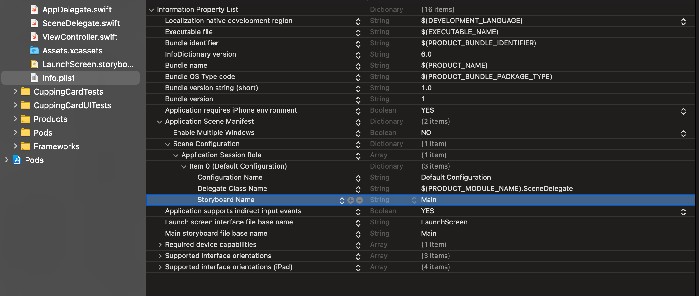
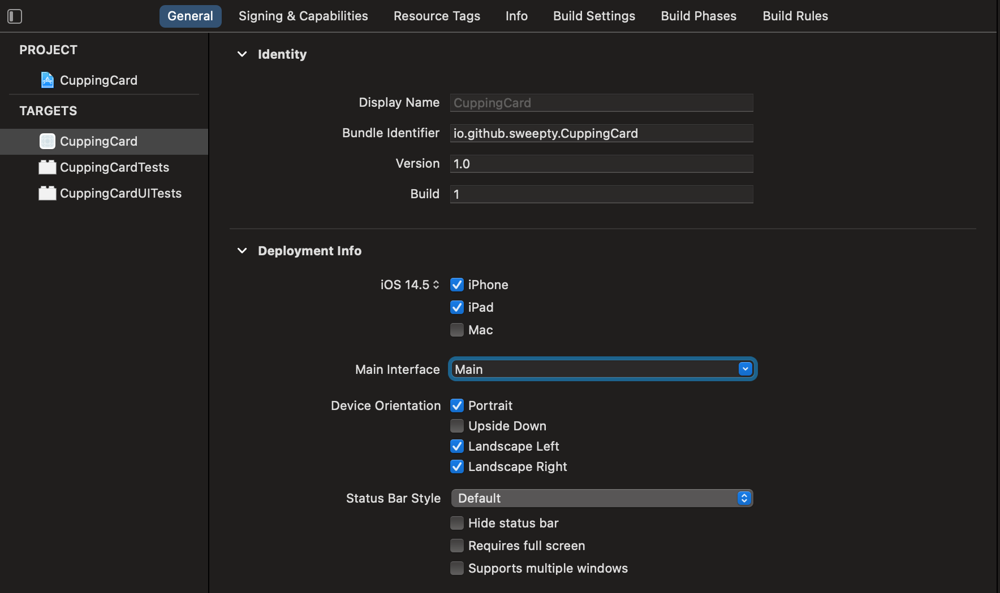

협업을 할 때 스토리보드를 사용하면 git에서 충돌이 나서 골치가 아픈 경우가 많습니다. 또 스토리 보드가 방대할 경우에는 파일을 여는 시간이 너무 오래걸리기도 합니다. 이럴 때 스토리보드 대신 코드를 사용해서 뷰를 구현하면 이 문제에서 해방될 수 있습니다.

#### Main.storyboard 삭제
Main.storyboard는 이제 사용하지 않으니 삭제하세요.

#### Info.plist에서 storybarod name 삭제
Application Scene Manifest 하위 항목을 보시면 `Storybard Name` 이 있습니다. 이 부분을 ⛔️ 버튼을 눌러서 삭제하세요.


#### SceneDelegate.swift 파일 수정
`SceneDelegate.swift` 파일에서 `func scene()` 메서드 내에 rootViewController를 설정해줍니다.

```swift
guard let windowScene = (scene as? UIWindowScene) else { return }

let homeViewController = ViewController()

let win = UIWindow(windowScene: windowScene)
win.rootViewController = homeViewController
win.makeKeyAndVisible()
self.window = win
```

TabBarController를 보여주고 싶을 때

```swift
guard let windowScene = (scene as? UIWindowScene) else { return }
        
let tabBarController = UITabBarController()

// Tab 1 - Home
let homeVc = ViewController()
let firstTabNav = UINavigationController(rootViewController: homeVc)
let item1 = UITabBarItem(tabBarSystemItem: .search, tag: 0)
firstTabNav.tabBarItem = item1

// Tab 2 - Favorite
let favoriteVc = FavoriteViewController()
let secondTabNav = UINavigationController(rootViewController: favoriteVc)
let item2 = UITabBarItem(tabBarSystemItem: .favorites, tag: 1)
secondTabNav.tabBarItem = item2

tabBarController.viewControllers = [firstTabNav, secondTabNav]

let win = UIWindow(windowScene: windowScene)
win.rootViewController = tabBarController
win.makeKeyAndVisible()
self.window = win
```


#### Target > general > main interface에 있는 Main 삭제


잘 되었는지 빌드해서 확인하면 끝입니당

혹시 잘못된 부분이 있다면 댓글 달아주시면 감사하겠습니다!!
